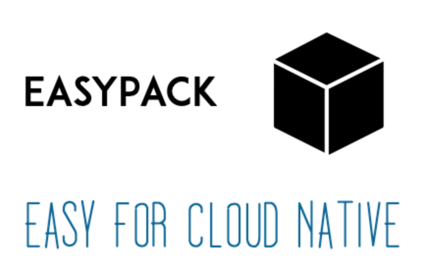

# 云原生工具系列
## Kubernetes
<table border="0">
    <tr>
        <td><a href="https://blog.csdn.net/liumiaocn/column/info/12761">00-基础知识</a></td>
        <td><a href="k8s/README.md">01-使用说明文档</a></td>
        <td><a href="k8s/shell">02-脚本部署方式</a></td>
        <td><a href="k8s/ansible">03-Ansible部署方式</a></td>
    </tr>
</table>

## 轻量级Kubernetes：k3s
<table border="0">
    <tr>
        <td><a href="https://liumiaocn.blog.csdn.net/article/details/103268634">01-使用说明文档</a></td>
        <td><a href="containers/standard/rancher/k3s/shell">02-脚本部署方式</a></td>
        <td><a href="containers/standard/rancher/k3s/ansible">03-Ansible部署方式</a></td>
    </tr>
</table>

## MESOS
<table border="0">
    <tr>
        <td><a href="https://blog.csdn.net/liumiaocn/article/details/54285586">00-简介</a></td>
        <td><a href="https://blog.csdn.net/liumiaocn/article/details/54310217">01-Zookeeper简介</a></td>
        <td><a href="https://blog.csdn.net/liumiaocn/article/details/54339732">02-Marathon简介</a></td>
        <td><a href="https://blog.csdn.net/liumiaocn/article/details/54405044">03-环境搭建</a></td>
        <td><a href="mesos">04-相关代码</a></td>
    </tr>
</table>

## Helm
<table border="0">
    <tr>
        <td><a href="https://raw.githubusercontent.com/helm/helm/master/scripts/get-helm-3">00-安装</a></td>
        <td><a href="https://blog.csdn.net/liumiaocn/category_9561027.html">01-使用介绍</a></td>
    </tr>
</table>

# DevOps主流工具
## 持续集成与持续构建
<table border="0">
    <tr>
        <td><a href="https://liumiaocn.blog.csdn.net/article/category/8598907">Jenkins使用介绍</a></td>
        <td><a href="https://blog.csdn.net/liumiaocn/column/info/27057">持续集成实践</a></td>
        <td><a href="containers/alpine/jenkins">Jenkins</a></td>
        <td><a href="https://blog.csdn.net/liumiaocn/article/details/84341611">构建工具Gradle实践介绍</a></td>
        <td><a href="containers/alpine/jenkins">构建工具Gradle</a></td>
    </tr>
        <tr>
        <td><a href="https://liumiaocn.blog.csdn.net/article/details/103640872">安卓SDK镜像</a></td>
        <td><a href="https://blog.csdn.net/liumiaocn/column/info/27057">gradlew+docker+SDK</a></td>
            <td><a href="https://blog.csdn.net/liumiaocn/column/info/27057">gradle+docker+SDK</a></td>
    </tr>
</table>

## 版本管理
<table border="0">
    <tr>
        <td><a href="https://blog.csdn.net/liumiaocn/article/details/82286778">00-Gitlab使用介绍</a></td>
        <td><a href="containers/standard/gitlab">01-gitlab相关代码</a></td>
        <td><a href="containers/alpine/svn/README.md">02-SVN使用介绍</a></td>
        <td><a href="containers/alpine/svn">04-SVN相关代码</a></td>
    </tr>
</table>

## 镜像仓库
<table border="0">
    <tr>
        <td><a href="https://blog.csdn.net/liumiaocn/column/info/26478">00-镜像仓库介绍</a></td>
        <td><a href="https://blog.csdn.net/liumiaocn/article/details/81805063">01-Harbor搭建</a></td>
        <td><a href="https://blog.csdn.net/liumiaocn/article/details/81813693">02-Https方式</a></td>
        <td><a href="https://blog.csdn.net/liumiaocn/article/details/86515962">03-Https连接方式</a></td>
        <td><a href="https://blog.csdn.net/liumiaocn/article/details/81813705">04-REST API使用</a></td>
        <td><a href="https://blog.csdn.net/liumiaocn/article/details/81813707">05-集成Clair</a></td>
    </tr>
</table>

## 代码质量：SonarQube
<table border="0">
    <tr>
        <td><a href="https://liumiaocn.blog.csdn.net/article/category/8559161">00-使用介绍</a></td>
        <td><a href="containers/standard/gitlab">02-相关代码</a></td>
    </tr>
</table>

## 需求与缺陷管理：Redmine
<table border="0">
    <tr>
        <td><a href="https://liumiaocn.blog.csdn.net/article/details/83951987">00-使用介绍</a></td>
        <td><a href="containers/standard/gitlab">02-相关代码</a></td>
    </tr>
</table>

## 容器化管理：Rancher
<table border="0">
    <tr>
        <td><a href="containers/standard/rancher">00-使用介绍</a></td>
        <td><a href="containers/standard/rancher">02-相关代码</a></td>
    </tr>
</table>

## 木马扫描：ClamAV
<table border="0">
    <tr>
        <td><a href="https://blog.csdn.net/liumiaocn/article/details/76577867">00-使用介绍</a></td>
        <td><a href="clamav">02-安装脚本</a></td>
    </tr>
</table>

# 其他工具
## tensorflow入门实战
<table border="0">
    <tr>
        <td><a href="https://blog.csdn.net/liumiaocn/article/details/82851824">00-使用介绍</a></td>
        <td><a href="machinelearning/tensorflow">01-相关内容</a></td>
    </tr>
</table>

## 开源数据库：MySQL
<table border="0">
    <tr>
        <td><a href="https://liumiaocn.blog.csdn.net/article/details/88406119">00-使用介绍</a></td>
        <td><a href="containers/standard/mysql">02-相关代码</a></td>
    </tr>
</table>

## 开源数据库：MariaDB
<table border="0">
    <tr>
        <td><a href="https://liumiaocn.blog.csdn.net/article/details/88406119">00-使用介绍</a></td>
        <td><a href="containers/alpine/maria">02-相关代码</a></td>
    </tr>
</table>

